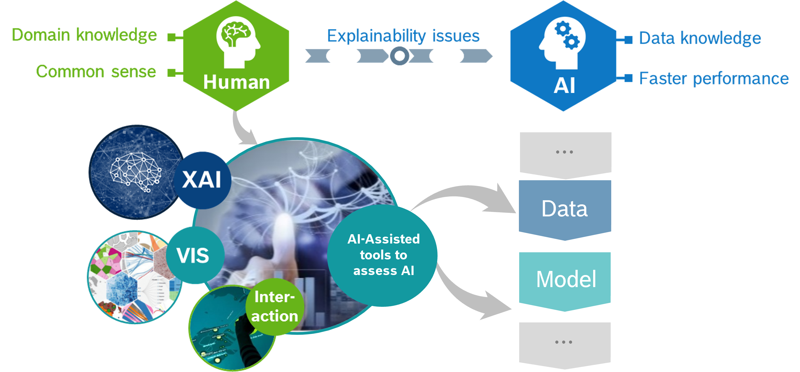

About Us
========

eXplainable AI validation service allows a user to evaluate the strength and weakness of a CNN object detector in a human interpretable manner.

Visual Verification and Validation of CNN Detectors (V3D) is one such tool from XAI service.
In comparison to the traditional validation, where the user or developer gets an over-simplified metric, example: mAP or accuracy,

* V3D lets a user to trace back the reason for a bad performance metric upto a single-frame level.
* In addition, we let the user to analyse what is the underlying reason the bad metric.

Both the aforementioned benefits of V3D is made possible by our interactive state-of-the-art user interface and visualization.

Our tools are strongly coupled with two main building blocks of an AI system, i.e., data and model.
Hence, when a user tries to identify the reason for a low metric, XAI serves as a bridge betwen the human and AI system.

Request access
--------------
Our artifacts access is managed by security group `XAIOnePMTUsers <https://service-management.bosch.tech/sp?id=sc_cat_item&sys_id=ae0fa1bb1b87551078087403dd4bcbf2>`_.

Quick demo
----------
`Momenta 2d traffic light detector analysis <https://tube.video.bosch.com/media/Momenta%20TL%20dataset%20and%20TL%20detector%20analysis%20using%20XAI/0_8ns2fgme>`_.

.. list-table:: Showcase datasets currently hosted on VoxelTeams of DYPER51
   :widths: 25 12 13 12 13 12 13
   :header-rows: 1

   * - Modality
     - Dataset
     - Basic feature
     - Summary tab
     - Sensitivity analysis
     - Robustness
     - Link
   * - 3D detections bobox
     - L4 PERVIS
     - Yes
     - Yes
     - Yes
     - WIP
     - `Link <https://dev.dyper-dasem.bosch-automotive-mlops.com/datasets/l4-vision-live/samples>`_
   * - Keypoints
     - IMS
     - Yes
     - No
     - No
     - WIP
     - `Link <https://dev.dyper-dasem.bosch-automotive-mlops.com/datasets/ims-live/samples>`_
   * - 2D detections bobox
     - Momenta
     - Yes
     - Yes
     - WIP
     - WIP
     - `Link <https://dev.dyper-dasem.bosch-automotive-mlops.com/datasets/momenta-live/samples>`_

Reach us
--------
`Our teams channel <https://teams.microsoft.com/l/team/19%3Aw5XBCtFsLCfPlqJeCauo8Q-DF9N4im-a0ciZfj0tvzw1%40thread.tacv2/conversations?groupId=83d51cc3-be46-428e-8414-83736a3bd12d&tenantId=0ae51e19-07c8-4e4b-bb6d-648ee58410f4>`_.
